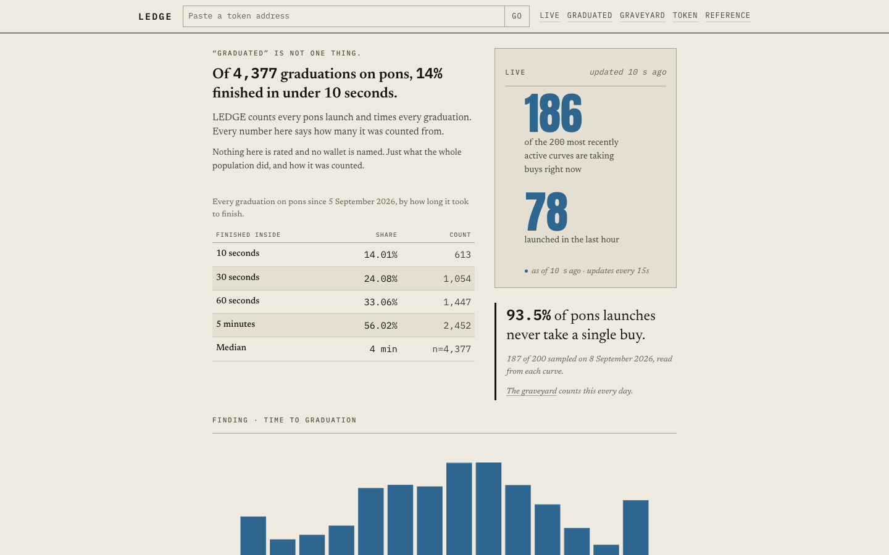

<p align="center">
  <a href="https://ledge.tools"></a>
</p>

<p align="center"><b>Counts every pons launch on Robinhood Chain. Every figure with its n.</b><br>
<a href="https://ledge.tools">ledge.tools</a> · <a href="https://ledge.tools/method">method</a> · <a href="https://ledge.tools/number.json">number.json</a> · <a href="https://t.me/ledgetools_bot">Telegram bot</a> · <a href="https://x.com/ledge_tools">@ledge_tools</a></p>

<p align="center">
  <a href="https://ledge.tools"></a>
</p>

[pons](https://www.ponsfamily.com) is a memecoin launchpad on Robinhood Chain.
It launches tens of thousands of tokens a day. LEDGE reads every launch and
every graduation the pons factory emits, straight from the chain, and
publishes what it counts: how many launches graduate to a liquidity pool,
how fast, when the first outside buy lands, which launches never take a
single buy, and what the price does after a graduation.

The card above is live. It is drawn from the same file every number on the
site comes from, and it carries the time it was measured.

## The rules

LEDGE **rates, ranks and predicts nothing. It counts.** The rules it will not
break are written down in [`CONSTRAINTS.md`](CONSTRAINTS.md) and dated when
they change. The ones that matter most:

- **No verdict on any token.** No score, no grade, no "safe", no call. A
  token's page shows what happened on its curve and how launches like it did.
- **Every rate carries its sample size.** Under 30 in a sample and the share
  is withheld: the page prints "not enough data (n=…)", never a percentage.
- **No wallet is ever named.**
- **An ugly number is never taken down.** A figure that reverses is
  published with the old value in the changelog.
- **Free, unkeyed, for ever.** No wallet, no account, no paywall on any figure.
- **Independent.** Not affiliated with, endorsed by, or operated by Pons Labs, LLC.

## Check any figure yourself

Every number on the site is derived from the raw event records in
[`data/`](data/) by one command, with no network access:

```
python pipeline/recompute.py --data-dir data --out data/number.json --check
```

`--check` rebuilds `number.json` and diffs it byte for byte against the
committed one. CI runs the same command on every push; a deploy cannot go
out with a figure that does not recompute. `data/number.json` is committed
on every crawl, so its git history is every number the site has ever shown.

Only [`pipeline/stats.py`](pipeline/stats.py) computes a statistic. The site,
the Worker and the bot read the file and print what they find; a lint in CI
refuses arithmetic anywhere else. What counts as a launch, a graduation, a
"fast" graduation and a dead launch is defined once, in
[`METHOD.md`](METHOD.md), and is binding on the crawl, the site and the tests.

## What is published

<p align="center"></p>

| | |
| --- | --- |
| [ledge.tools](https://ledge.tools) | The graduation rate, with and without graduations inside 5 minutes, and how long graduations take. |
| [/cohorts](https://ledge.tools/cohorts) | The same by pair token, creator tax, hour and day. Price after graduation. When the first outside buy lands. |
| [/live](https://ledge.tools/live) · [/graduated](https://ledge.tools/graduated) · [/graveyard](https://ledge.tools/graveyard) | Every curve taking buys now. Every graduation and its time. Every launch with no buy in 72 hours. |
| [/t/{address}](https://ledge.tools/t) | Any token: buys, sells, fill, first outside buy, launch-block buyers, and how launches like it did. |
| [/number.json](https://ledge.tools/number.json) | Every published figure in one versioned file. [CC BY 4.0](data/LICENSE). |
| [@ledgetools_bot](https://t.me/ledgetools_bot) | The same lookup on Telegram: send any address. The room [@ledgetools](https://t.me/ledgetools) gets a daily digest. |
| [/launch](https://ledge.tools/launch) | LEDGE's own token launch on pons, pre-registered and committed before it happens, counted by the same rules. |

## How it runs

Two layers. A Python crawl on a small box reads the factory's events every
ten minutes, recomputes the figures and commits the record. A live indexer
follows the chain every few seconds into Cloudflare D1 for the boards, the
token pages and the bot. Both read the chain through one RPC gateway that
paces, fails over and caches.

```
pipeline/     the crawl, the statistics, the recompute gate, the stall alert
data/         the record: launches and graduations as daily JSONL, number.json
worker/       Cloudflare Worker: API, token pages, figure cards, Telegram bot
worker/host/  the live indexer, run as a loop on the box against D1
gateway/      the RPC gateway
site/         Next.js static export on Vercel; /api and /t go to the Worker
contracts/    LedgeOracle: the headline reading mirrored on-chain, rates with counts
ops/          systemd units for the box
docs/         architecture, the indexer, deployment, incidents
```

[`docs/ARCHITECTURE.md`](docs/ARCHITECTURE.md) and [`docs/INDEXER.md`](docs/INDEXER.md)
explain the two layers. [`docs/INCIDENTS.md`](docs/INCIDENTS.md) is every
outage and mistake so far, with what guards each one now.

## Tests

```
pytest pipeline/tests -q            # the pipeline
npm test --prefix worker            # the Worker and the host runner
npm test --prefix site              # the site
npm test --prefix gateway           # the gateway
bash scripts/lint-worker.sh         # no statistics outside stats.py
bash scripts/lint-copy.sh           # no banned copy on any public surface
```

## License

Code under [MIT](LICENSE). The record in `data/` under
[CC BY 4.0](data/LICENSE): use it freely, say it came from LEDGE.
